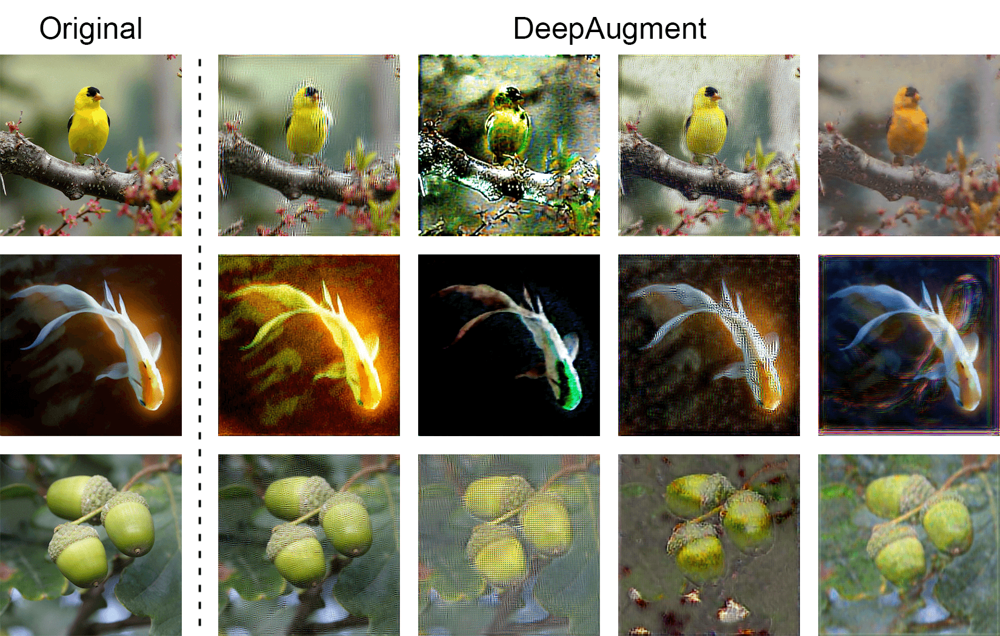

# DeepAugment



## DeepAugment Files

Here is an overview of the files needed to create ImageNet training data augmented with DeepAugment.
Alternatively, you can download our [EDSR](https://drive.google.com/file/d/1Ij_D3LuHWI4_WOlsg6dJMAPKEu10g47_/view?usp=sharing) and [CAE](https://drive.google.com/file/d/1xN9Z7pZ2GNwRww7j8ClPnPNwOc12VsM5/view?usp=sharing) images directly.


## Create Datasets
 - `EDSR_distort_imagenet.py`: Creates a distorted version of ImageNet using EDSR (https://arxiv.org/abs/1707.02921)
 - `CAE_distort_imagenet.py`: Creates a distorted version of ImageNet using a CAE (https://arxiv.org/abs/1703.00395)

The above scripts can be run in parallel to speed up dataset creation (multiple workers processing different classes). For example, to split dataset creation across 5 processes, run the following in parallel:
```bash
    CUDA_VISIBLE_DEVICES=0 python3 EDSR_distort_imagenet.py --total-workers=5 --worker-number=0
    CUDA_VISIBLE_DEVICES=1 python3 EDSR_distort_imagenet.py --total-workers=5 --worker-number=1
    CUDA_VISIBLE_DEVICES=2 python3 EDSR_distort_imagenet.py --total-workers=5 --worker-number=2
    CUDA_VISIBLE_DEVICES=3 python3 EDSR_distort_imagenet.py --total-workers=5 --worker-number=3
    CUDA_VISIBLE_DEVICES=4 python3 EDSR_distort_imagenet.py --total-workers=5 --worker-number=4
```
You will need to change the save path and original ImageNet train set path.

