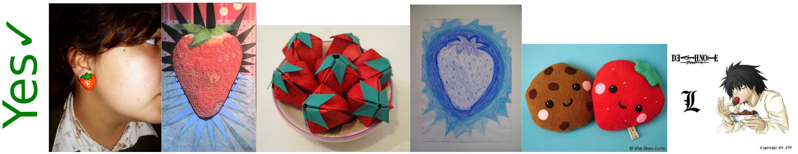
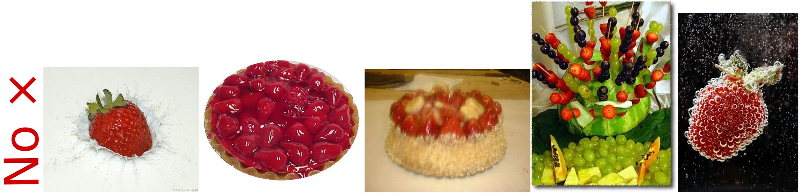

# ImageNet-R
ImageNet-R(endition) contains art, cartoons, deviantart, graffiti, embroidery, graphics, origami, paintings, patterns, plastic objects, plush objects, sculptures, sketches, tattoos, toys, and video game renditions of ImageNet classes.

ImageNet-R has renditions of 200 ImageNet classes resulting in 30,000 images.

__[Download ImageNet-R here](https://people.eecs.berkeley.edu/~hendrycks/imagenet-r.tar).__

# Other Resources
This repository also contains code for DeepAugment and DeepFashion Remixed experiments.

Additionally, Real Blurry Images are available for download [here](https://people.eecs.berkeley.edu/~hendrycks/blurry_images.tar).

Weights for a ResNet-50 ImageNet classifier trained with DeepAugment are available
[here](https://drive.google.com/file/d/1DPRElQnBG66nd7GUphVm1t-5NroL7t7k/view?usp=sharing).

Weights for a ResNet-50 ImageNet classifier trained with DeepAugment+AugMix are available
[here](https://drive.google.com/file/d/14iJjRKnRsx2SfoHQ7qrWif8Fd8aXgD6b/view?usp=sharing).

Weights for a ResNeXt-101 (32x8d) ImageNet classifier trained with DeepAugment+AugMix are available
[here](https://drive.google.com/file/d/1U71SoHQjAkOOte4Uc0A4nh1JzRf9Ec8C/view?usp=sharing).

## Citation

If you find this useful in your research, please consider citing:

    @article{hendrycks2020many,
      title={The Many Faces of Robustness: A Rigorous Evaluation of Realistic Distribution Shifts},
      author={Dan Hendrycks and Steven Basart and Norman Mu and Saurav Kadavath and Frank Wang and Evan Dorundo and Rahul Desai and Tyler Zhu and Samyak Parajuli and Mike Guo and Dawn Song and Jacob Steinhardt and Justin Gilmer},
      journal={arXiv},
      year={2020}
    }
